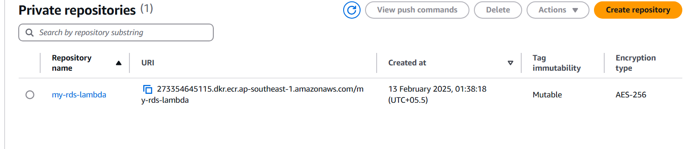

# CI/CD Pipeline with AWS, Terraform & Jenkins

This repository showcases the implementation of a CI/CD pipeline using AWS services, Terraform, Jenkins, and Docker. The pipeline automates infrastructure provisioning, application deployment, and updates.

## Project Overview

This project involves:
- Automating AWS infrastructure setup using Terraform.
- Uploading files to S3 and pushing data to an RDS database.
- Building a Docker image and deploying it to Amazon ECR.
- Creating an AWS Lambda function using the Docker image.
- Setting up a CI/CD pipeline using Jenkins.

### 1️⃣ **Infrastructure as Code (IaC) with Terraform**
- Provisioned AWS resources including EC2, S3, RDS.
- Used Terraform to define and manage the cloud infrastructure.

### 2️⃣ **Uploading Files to S3 and Pushing Data to RDS**
- Uploaded application files to an Amazon S3 bucket.
- Stored structured data into an Amazon RDS MySQL database.

### 3️⃣ **Building & Pushing Docker Image to ECR**
- Created a Docker image for the application.
- Pushed the image to Amazon Elastic Container Registry (ECR) for containerized deployment.

### 4️⃣ **Deploying AWS Lambda Function**
- Created an AWS Lambda function using the Docker image stored in ECR.
- Configured necessary permissions and triggers.

### 5️⃣ **CI/CD Pipeline with Jenkins**
- Set up a Jenkins pipeline to automate deployment.
- Configured GitHub integration, build triggers, and deployment steps.

## 📸 Screenshots
Here are some screenshots of the setup and execution:

## Technologies Used
- **AWS Services**: EC2, S3, RDS, ECR, Lambda
- **DevOps Tools**: Terraform, Docker, Jenkins
- **Programming Language**: Python 
- **Version Control**: GitHub

